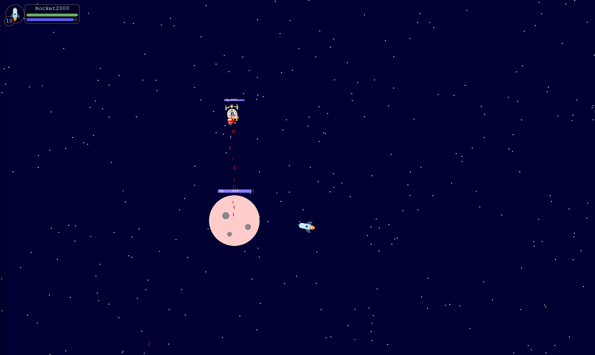

# Oids - A multiplayer space adventure

## Space and Ships, what can go wrong?

### Frontend dev server:

<code>npm run dev</code>

### WebSocket relay and API server:

<code>npm run server</code>

### Built With

* [TypeScript](https://www.typescriptlang.org/)
* [Svelte](https://svelte.dev/) - Frontend
* [ws](https://github.com/websockets/ws) - Node.js Websocket
* [Express](https://expressjs.com/) - API Endpoints
* [Prisma](https://www.prisma.io/) - Database
* [Mathil](https://www.npmjs.com/package/mathil) - Game and Math Engine - Made by [Emil Ransed - Oids Developer](https://github.com/eransed) 

<!-- CONTRIBUTING -->
## Contributing

Contributions are what make the open source community such an amazing place to learn, inspire, and create. Any contributions you make are **greatly appreciated**.

If you have a suggestion that would make this better, please fork the repo and create a pull request. You can also simply open an issue with the tag "enhancement".
Don't forget to give the project a star! Thanks again!

1. Fork the Project
2. Create your Feature Branch (`git checkout -b feature/AmazingFeature`)
3. Commit your Changes (`git commit -m 'Add some AmazingFeature'`)
4. Push to the Branch (`git push origin feature/AmazingFeature`)
5. Open a Pull Request